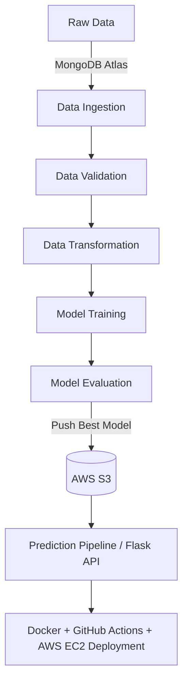

# 🚗 Car-Insurance-Prediction-Data-Science-Project-MLOPS


A **production-ready end-to-end MLOps pipeline** for vehicle data, showcasing best practices in:

- ⚙️ **Project structuring & environment management**
- 🗄️ **MongoDB Atlas database integration**
- 📊 **Data ingestion, validation & transformation**
- 🤖 **Model training, evaluation & pushing to AWS S3**
- 🚀 **Prediction pipeline with FastAPI/Flask**
- 🐳 **Dockerization & CI/CD with GitHub Actions & AWS EC2/ECR**

This project is designed to **Showcase expertise to recruiters, hiring managers, and collaborators** by demonstrating modern MLOps workflows.

---

## 📂 Project Workflow

### 🔧 1. Environment & Project Setup

- Generate template using `template.py`
- Manage dependencies via **setup.py** & **pyproject.toml**
- Create & activate virtual environment:

  ```bash
  conda create -n vehicle python=3.10 -y
  conda activate vehicle
  pip install -r requirements.txt
  ```

- Verify installations with `pip list`

---

### 🍃 2. MongoDB Atlas Setup

- Create cluster (M0 free tier) & DB user
- Configure network access (`0.0.0.0/0`)
- Connect with **Python driver** & store credentials as environment variables
- Push datasets into MongoDB and verify via Atlas Collections

---

### 📝 3. Logging, Exceptions & Notebooks

- Centralized **logger** & **exception handling**
- Jupyter notebooks for:

  - Exploratory Data Analysis (EDA)
  - Feature Engineering
  - MongoDB data ingestion demo

---

### 📥 4. Data Ingestion

- Define configs in `constants` & `config_entity.py`
- Create **MongoDB connection utilities**
- Transform key-value pairs → Pandas DataFrames
- Track ingestion artifacts

---

### ✅ 5. Data Validation, Transformation & Training

- Schema-driven validation via `config.schema.yaml`
- Feature transformation pipeline (`estimator.py`)
- Model training with versioned artifacts

---

### ☁️ 6. AWS Integration

- IAM user setup with `AdministratorAccess`
- Configure **AWS S3** bucket (`my-model-mlopsproj`)
- Store & retrieve models with `s3_estimator.py`
- Threshold-based model evaluation (`MODEL_EVALUATION_CHANGED_THRESHOLD_SCORE=0.02`)

---

### 🧪 7. Model Evaluation & Pusher

- Compare new model vs existing S3 models
- Push **production-ready models** to S3

---

### 🌐 8. Prediction Pipeline & Web App

- Flask/FastAPI app with `app.py`
- Includes `/predict` and `/training` routes
- Static & template directories for UI

---

### 🔄 9. CI/CD Pipeline with AWS & GitHub Actions

- **Dockerized application** with `Dockerfile` & `.dockerignore`
- GitHub Actions workflow (`.github/workflows/aws.yaml`)
- Self-hosted runner on AWS EC2 Ubuntu
- ECR for Docker image registry
- Automated deployment to EC2 with port exposure (`5080`)

---

## 🚀 Tech Stack

| Layer                    | Tools / Services                                                |
| ------------------------ | --------------------------------------------------------------- |
| **Language**             | Python 3.10                                                     |
| **Environment Mgmt**     | Conda, requirements.txt                                         |
| **Database**             | MongoDB Atlas                                                   |
| **ML Lifecycle**         | EDA, Data Ingestion, Validation, Transformation, Model Training |
| **Cloud**                | AWS (S3, IAM, EC2, ECR)                                         |
| **Containerization**     | Docker                                                          |
| **CI/CD**                | GitHub Actions + AWS Runner                                     |
| **Orchestration**        | Training & Prediction Pipelines                                 |
| **Logging & Exceptions** | Custom Logger & Exception modules                               |
| **Web Framework**        | Flask/FastAPI                                                   |

---

## 📊 Architecture



---

## 🏆 Key Features

- Modular **project template** for scalability
- Database-driven ingestion with **MongoDB Atlas**
- **Custom logging & exception handling**
- Schema-based **data validation**
- Cloud-native **model registry with AWS S3**
- CI/CD pipeline with **GitHub Actions → AWS EC2**
- **Dockerized** deployment for portability

---

## ⚡ How to Run

1. Clone repo & setup environment

   ```bash
   git clone <repo-url>
   cd vehicle-mlops
   conda activate vehicle
   pip install -r requirements.txt
   ```

2. Configure environment variables (MongoDB, AWS credentials)
3. Run training:

   ```bash
   python demo.py
   ```

4. Start API server:

   ```bash
   python app.py
   ```

5. Open in browser:

   ```
   http://<EC2-Public-IP>:5080
   ```

---

## 📌 Future Improvements

- Add **MLflow** for experiment tracking
- Deploy with **Kubernetes + Helm**
- Add **monitoring (Prometheus + Grafana)**
- Integrate **feature store (Feast)**

---
